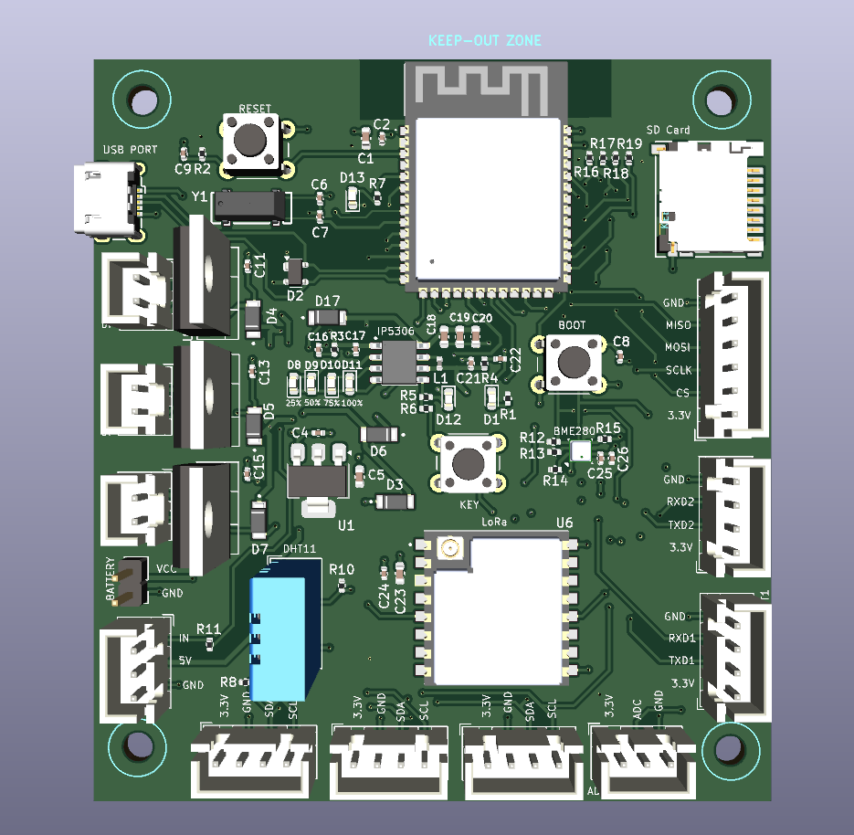

# SDR‑IoT‑Board

An IoT-based edge device and ground-station platform designed for telemetry and mission data—integrated with a 1U nanosatellite workflow. The hardware centers on an ESP32‑S3 module with LoRa, microSD storage, battery management/charging, sensor interfaces, and multiple expansion headers for rapid prototyping and deployment.

  
   
  
   
  
   

## Table of Contents

- Overview
- Key Features
- Hardware Architecture
- Power Architecture
- Interfaces and Connectors
- Major Components
- Project Structure
- Manufacturing (Gerbers, BOM, CPL)
- Bring‑Up Checklist
- Firmware Getting Started
- Mechanical and 3D Models
- License
- Acknowledgements and Notes

## Overview

This repository contains the complete KiCad design for the IoT Edge Device v1.0, including schematic, PCB layout, fabrication outputs, custom footprints, and mechanical models. No firmware is included in this repository; the board is intended to be programmed using the ESP32‑S3’s native USB interface (ESP‑IDF or Arduino‑ESP32).

Use cases include ground-station telemetry collection, environmental sensing, edge data logging, and LoRa-based long-range links to remote nodes or satellite payload testbeds.

## Key Features

- ESP32‑S3‑WROOM‑1‑N16R8 module (16 MB flash, 8 MB PSRAM)
- LoRa radio module (Ai‑Thinker RA‑02, SPI interface)
- microSD storage (SPI mode selected; design notes on SPI vs. SDIO)
- Environmental sensing: BME280 (I2C; default address 0x76), DHT11 header
- Multiple I2C expansion headers for quick peripheral add‑ons
- Two UART headers for serial peripherals and diagnostics
- Relay driver header (external 5 V relay module), driven via ESP32‑S3 GPIO6 through 1 kΩ
- Native USB (Micro‑B) with ESD protection for data and power
- Battery management/boost via IP5306 module; status LEDs for charge/level
- 3.3 V rail via AMS1117‑3.3 LDO
- 32.768 kHz RTC crystal for ESP32‑S3 (ESR ≤ 70 kΩ per note)

  
  
  
   
  
  
  

## Hardware Architecture

- Microcontroller: ESP32‑S3‑WROOM‑1‑N16R8 (`IoT Edge Device v1.0/IoT Edge Device V1.kicad_sch`)
- Radio: RA‑02 LoRa (SPI: `MOSI_LORA`, `MISO_LORA`, `SCLK_LORA`, `CS_LORA`)
- Storage: microSD (SPI: `MOSI_SD`, `MISO_SD`, `SCLK_SD`, `CS_SD`)
- Sensors: BME280 on I2C (SDO pulled Low → default 0x76), DHT11 via single‑wire `DHT_DATA` header
- Expansion: three I2C headers (`SCL_OUT`, `SDA_OUT`), SPI header, UART1/2 headers
- Control: Relay header driven from ESP32‑S3 GPIO6 via 1 kΩ current‑limit resistor
- Clocking: 32.768 kHz crystal for RTC; ensure ESR ≤ 70 kΩ
- Protection: SP05xxx ESD array on USB; Schottky diodes for power ORing

Notes
- Design text documents the choice of SPI over SDIO for simplicity (SDIO is faster but higher complexity/CPU tradeoffs).
- Exact ESP32 GPIO mappings for the above nets are defined in the schematic; see the KiCad file for authoritative pinout and update firmware pin definitions accordingly.

## Power Architecture

- Sources: 5 V via USB Micro‑B and from IP5306 boost output; diode‑OR prevents back‑feeding.
- Solar input: 12 V panel → external LM7805 module → 5 V for IP5306 input (see design note). For higher efficiency and thermal margin, a buck regulator is recommended over linear.
- Battery: IP5306 manages charging and provides 5 V output; LED indicators for charge and capacity.
- 3.3 V rail: AMS1117‑3.3 LDO powers ESP32‑S3, LoRa, and sensors.

Recommendations
- Consider replacing the 12 V→5 V LM7805 path with a high‑efficiency buck (e.g., LM2596/MP1584) to reduce heat and increase battery/runtime performance.
- Validate 3.3 V load headroom (ESP32‑S3 + LoRa TX + SD activity) and thermal dissipation for the LDO.

## Interfaces and Connectors

- USB: Micro‑B connector; native ESP32‑S3 USB (D+ / D−) for flashing and CDC; ESD protection present.
- I2C: labeled I2C1 / I2C2 / I2C3 headers on `SCL_OUT` and `SDA_OUT` nets.
- SPI: dedicated header labeled “SPI Connector”.
- UART: UART1 and UART2 headers; UART2 noted for DAC use case.
- Relay: external 5 V relay module header; controlled by ESP32‑S3 GPIO6 via 1 kΩ series resistor.
- SD Card: microSD socket (SPI wiring).
- LoRa: RA‑02 module (SPI wiring with dedicated CS).

## Major Components

- X1: ESP32‑S3‑WROOM‑1‑N16R8 (MCU + Wi‑Fi/BLE, native USB)
- U6: Ai‑Thinker RA‑02 LoRa module (SPI)
- J15: microSD socket (Hirose DM3D‑SF)
- U8: BME280 environmental sensor (I2C, default 0x76)
- DHT11: external module via header (`DHT_DATA`)
- U5: IP5306 battery charger/boost controller
- U1: AMS1117‑3.3 linear regulator
- J1: USB Micro‑B connector
- D2: SP05xxx ESD protection for USB
- D4–D7: DFLS130L‑7 Schottky diodes (power ORing)
- Y1: 32.768 kHz crystal for RTC

See `IoT Edge Device v1.0/Fab Files/IoT BOM.csv` for the full sourced BOM (with JLCPCB part numbers) and `IoT Edge Device v1.0/Fab Files/IoT CPL.csv` for centroid/placements.

## Project Structure

- `IoT Edge Device v1.0/` — KiCad project (schematic, PCB, project metadata)
  - `IoT Edge Device V1.kicad_sch` — Schematic
  - `IoT Edge Device V1.kicad_pcb` — PCB layout
  - `Fab Files/` — Gerbers, drill, BOM, CPL for fabrication and assembly
  - `Fabrication Outputs.zip` — Consolidated fab package
- `Design Resources/` — Custom footprints and STEP models
- `Images/` — Renders and module screenshots used in this README

## Manufacturing (Gerbers, BOM, CPL)

All files required for fab and assembly are provided:

1) Gerbers and Drill
- Path: `IoT Edge Device v1.0/Fab Files/*gbr`, `.../IoT Edge Device V1.drl`

2) Bill of Materials
- Path: `IoT Edge Device v1.0/Fab Files/IoT BOM.csv` (includes JLCPCB part numbers)

3) Pick & Place (Centroid)
- Path: `IoT Edge Device v1.0/Fab Files/IoT CPL.csv` (Top placements)

## Bring‑Up Checklist

- Visual inspection: orientation, polarity, solder joints, shorts
- Power rails: verify 5 V and 3.3 V at no‑load, then under load
- USB enumeration: connect via Micro‑USB; confirm ESP32‑S3 CDC/DFU visibility
- Flash a minimal firmware (blinky/logging) to validate USB/boot path
- I2C scan: confirm BME280 responds at 0x76
- SD card: initialize via SPI; create/read a test file
- LoRa SPI: verify register read/write; simple TX/RX smoke test
- Status LEDs: battery/charge indicators via IP5306; power/relay LEDs
- Relay header: toggle GPIO6 and confirm external relay module control

## Firmware Getting Started

- Toolchains: ESP‑IDF (v5.x) or Arduino‑ESP32 with S3 support
- Transport: Native USB (CDC) for flashing and serial output
- Pin definitions: Map nets from the schematic to firmware pins:
  - LoRa SPI: `MOSI_LORA`, `MISO_LORA`, `SCLK_LORA`, `CS_LORA`
  - SD SPI: `MOSI_SD`, `MISO_SD`, `SCLK_SD`, `CS_SD`
  - I2C: `SDA_OUT`, `SCL_OUT`
  - DHT11: `DHT_DATA`
  - Relay: `GPIO6`

Since the ESP32 GPIO numbers tied to these nets can vary by routing, use the KiCad schematic (`.kicad_sch`) as the source of truth and set your firmware `gpio_num_t` values accordingly.

Libraries
- LoRa: `arduino-lmic` or `RadioLib` (Arduino), or ESP‑IDF SPI drivers with Semtech HAL equivalents
- microSD: `SD`/`SdFat` (Arduino) or ESP‑IDF `sdspi_host`
- BME280: Adafruit/ESP‑IDF drivers (I2C)
- DHT11: Adafruit (Arduino) or a simple single‑wire driver

## Mechanical and 3D Models

- STEP models for key parts are under `Design Resources/STEP Files/` (ESP32‑S3 module, RA‑02, IP5306, microSD, crystal, etc.)
- Use these for enclosure fit, heatsinking studies, and cable clearance.

## License

This project is released under the MIT License. See `LICENSE` for details.
